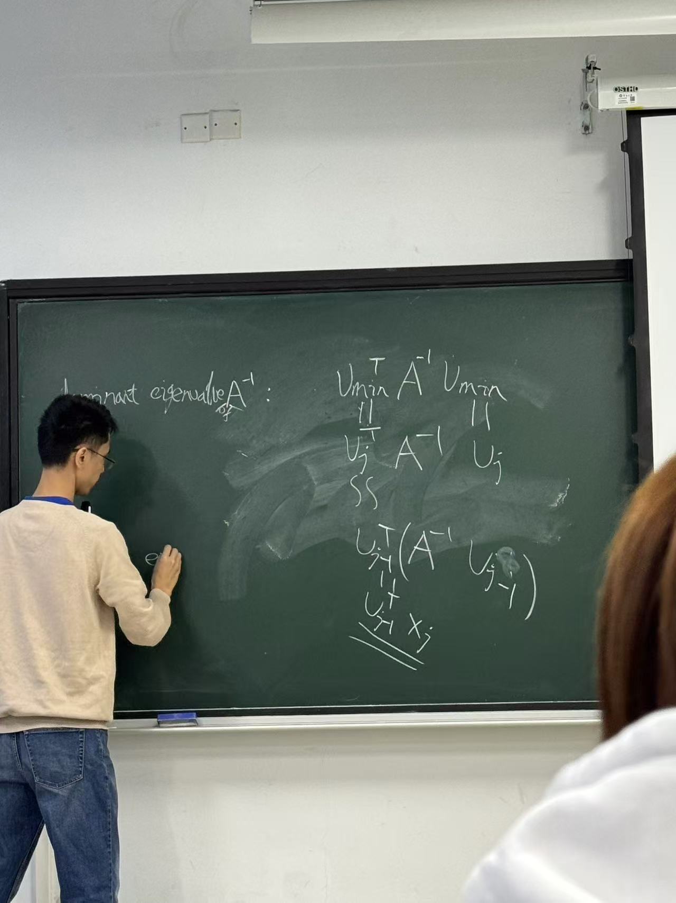

## Numerical Analysis :carrot:

---

###### Bg:

- 

---

##### Week 1 :handbag:  Chapter2——System of equation

- Preliminary works: **==Linear Algebra==** + Advanced Math + Data Structure + Algorithm
- Course Content:
  - Basic concepts of linear algebra like: vector, matrix
    - identity/inverse/singular matrix —— 单位矩阵，逆矩阵，奇异矩阵
    - multiplication —— 矩阵乘法
    - transpose —— 转置 ( ^T^A~ij~ = A~ji~)
    - norm(p-norm/Euclidean/Infinity norm) —— 范数(欧几里得范数/无穷范数)
    - Linear Subspace —— 线性子空间 (==**IMPORTANT**==)

##### Week 2 :handbag:

- Jacobi Method 雅可比方法（迭代求解矩阵1··解）
- Strictly diagonally dominance 严格组对角线（对角线上的element比所在行任一元素要大）
  - 可以通过移动行来获得一个这样的矩阵 单纯变换行并不影响矩阵本身
- LDU 分解
- Gauss-Seidel Method 高斯-赛德尔方法

##### Week 3 :handbag:

- Relaxation parameter 松弛参数方法（其实就是在高斯塞德尔方法上乘了个系数 然后进行数学运算把u~k+1~的系数变成一的移项的操作 仅此而已）
  - 只要是严格组对角线形式的矩阵 松弛参数在0-2的范围内可以收敛

- Eigenvalues and eigenvectors (==IMPORTANT== 考试重点!!!!!!!!)
  - 证明算法的数学性质的方法（eg.证明算法收敛（==重要==）（雅可比方法/高斯赛德尔方法）
  - 加速矩阵乘法的运算的性质
- diagonalizable 对角化
  - Similarity 相似性
- Spectral radius 谱半径

##### Week 4 :handbag:

- 证明高斯赛德尔方法收敛（**证明谱半径小于等于1**）（==重点考察==）
  - 严格组对角线占优
  - 利用上一页ppt的等式 应用到第m行
- symmetric
  - some properties
- positive-definite
  - some properties
- A-conjugate 共轭
- Conjugate Gradient Method 共轭梯度方法（==要学会如何计算出精确解！！！==） （==能得到一个精确解==）
  - ppt上标蓝的地方重点注意
  - basis vector 基向量两两之间正交
  - 5个notation
  - residual 是一个向量 也是两两之间相互正交的
  - 精髓为：每一个近似解对应和另一个近似解之间均为互相正交的关系，也是构成了一个n维空间，导致迭代n次后，一定能得到一个精确解

##### Week5 :handbag:

- Convergence 收敛
- Main Theory
  - ==**证明重点考察**==
- Precondition

##### Week6 :handbag:——Beginning of Chapter3——Interpolation 插值

- 

##### Week7 :handbag:

- Newton interpolation 的上界证明??
- Newton form's proof（==考试考牛顿插值==）
- error formula（==考察==）
- 

##### Week8 :handbag:

- 衡量两个函数在一个区间的距离（提及Weierstrass的时候）
- weierstrass与runge的区别
- chebyshev的性质（==考试内容==）

##### Week9 :handbag: —Chapter4—Least Square 最小二乘

- 原方程组无解，定义了一个最小二乘解
- Ax=b 方程左右两边同时乘A^T^
- 用residual 衡量最小二乘解与原式的gap

##### Week13:handbag:——Chapter12——eigenvalue and singular value

- Dominant eigenvalue and eigenvector
- Rayleigh quotient 是一个实数
- Power Iteration的收敛性（==重点考察==）
  - X~0~展开的系数中C~1~一定要不等于0
- smallest eigenvalue
  - lemma1：逆矩阵的eigenvalue变倒数，eigenvector不变（简简单单的移项）
  - 把求smallest归约到去找逆矩阵的dominant eigenvalue
  - 将A的逆矩阵的求解过程化简，移项成A来计算
  - 计算步骤采取了一个约等于的操作
    - 
- singular value and vectors 

- SVD 分解
  - 三个性质证明（区分λ的值，=0，>0）
    - Unitary
    - Orthogonality
    - Eigenvector

---

第二章

- Jacobi
  - 为啥有用（严格组对角线占优）
  - 证明（知道定理就行，假如谱半径严格小于1，任何初始向量带入最终都会收敛）
  - 迭代性收敛证明内容（==1==）
- Gauss
  - 计算过程（==1==）
  - 收敛性证明（==1==）
- 过松弛
  - 加了个参数而已
- 对称正定
  - 共轭梯度法
    - 计算过程（==1==）
    - 主定理证明（==1==）
    - 预处理（了解）

第三章: 插值（样本点生成匹配原样本点）

- **拉格朗日插值计算公式**（==1==）
  - 为什么拉格朗日插值生成的多项式完美匹配，**证明过程**（==1==）
  - proposition的详细证，**列出来式子，推导**（==1==）
- Main theorem的**唯一性**证明（==1==） （degree一定要<=n）
- Main theorem的**存在性**证明
- 牛顿差分方法
  - 对拉格朗日插值方法的改进，有系数
  - 计算过程（==1==）
  - Theorem来证明正确性（==1==）
- error formula(误差公式)的证明（==精髓==）
- 龙格现象
- 切比雪夫插值
  - Theorem证明（==1==）
  - 6个性质的考察（==1==）

第四章：最小二乘法（方程组没解的时候，算最小二乘解）

- 给解释讲清楚最小二乘解为什么会生效，怎么来的（==1==）
- 计算过程（==1==）
- 几个数值知道如何计算(2-norm……)（==1==）
- 拟合函数的计算(周期性、多项式、指数函数……)（==1==）
- QR 分解计算（==1==）
- 理论证明
  - householder reflectors的定义和证明（==1==）
  - Householder reflector的理论，计算……（==1==）

第十二章：

- power iteration（==1==）
- 总结（page链？）的技术的来龙去脉写一段文字（==1==）
- SVD分解（==1==）
  - 定理的成立的证明（==1==）
  - 如何用SVD分解来做图像压缩（==1==）

